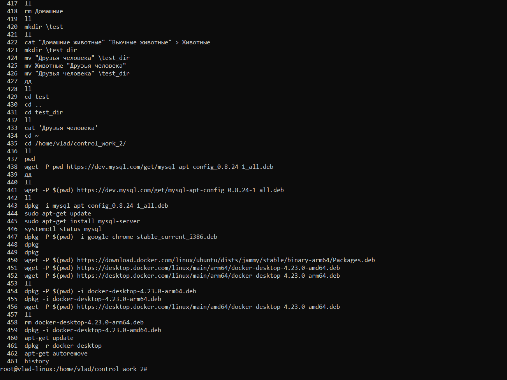

<div id="header" align="center">
        
</div>


# **Задание 1**
***Используя команду cat в терминале операционной системы Linux, создать
два файла Домашние животные (заполнив файл собаками, кошками,
хомяками) и Вьючные животными заполнив файл Лошадьми, верблюдами и
ослы), а затем объединить их. Просмотреть содержимое созданного файла.
Переименовать файл, дав ему новое имя (Друзья человека).***

:exclamation::exclamation::exclamation: <span style="color:red">***Сразу перешел в режим su***</span>.:exclamation::exclamation::exclamation:
```
*sudo su*
```
Далее
```
cat > "Домашние животные"
```
В открывшемся файле указываем Собака, Кошка, Хомяк
```
cat > "Вьючные животные"
```
В открывшемся файле указываем Лошадь, Верблюд, Осел
```
cat "Домашние животные" "Вьючные животные" > Животные
ls
mv Животные "Друзья человека"
ls
```

# **Задание 2**
***Создать директорию, переместить файл туда.***

```
mkdir \test_dir
mv "Друзья человека" \test_dir
```

# **Задание 3**
***Подключить дополнительный репозиторий MySQL. Установить любой пакет
из этого репозитория***

Скачиваем deb файл в текущий каталог
```
wget -P $(pwd) https://dev.mysql.com/get/mysql-apt-config_0.8.24-1_all.deb
```
Подключаем репозиторий
```
dpkg -i mysql-apt-config_0.8.24-1_all.deb
```
Далее подтверждаю полную установку

Обновляю инфо о пакетах
```
apt-get update
```
Установил сервер mysql
```
apt-get install mysql-server
```

# **Задание 4**
***Установить и удалить deb-пакет с помощью dpkg***

Качаю пакет 
```
wget -P $(pwd) https://desktop.docker.com/linux/main/amd64/docker-desktop-4.23.0-amd64.deb
```

Устанавливаю
```
dpkg -i docker-desktop-4.23.0-amd64.deb
```
Обновляю инфо о пакетах
```
apt-get update
```
Удаляю пакет и связанные
```
dpkg -r docker-desktop
apt-get autoremove
```

# **Задание 5**
***Выложить историю команд в терминале ubuntu***

```
history
```
